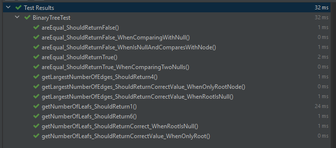

# Binary Tree

### Tech stack
Created using Java, gradle and JUnit5.

### Features
- Calculating the number of nodes that do not have any children
- Calculating the largest number of edges in a path from the root node to a leaf node
- Checking if two instances are equivalent to each other

### Test results

